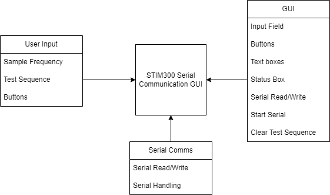
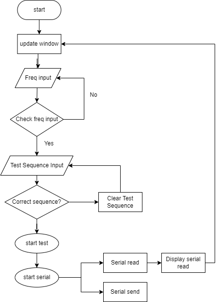

# System Design

## Overview

This document provides an overview of the design of the [Your System Name] system. It includes a block diagram illustrating the main components and their interactions.

## Block Diagram

### Figure 1: System Block Diagram

### Figure 2: Flowchart

## System Components

#### User Input:
Sample Frequency: Input field for entering the sample frequency in Hz.
Test Sequence Input: Buttons for predefined test sequences.

#### Tkinter GUI:
Input Field: Accepts sample frequency input.
Buttons: Trigger actions such as entering sample frequency, clearing test sequence, and running tests.
Text Boxes: Display test sequences, serial read data, and system status.
Start Serial Button: Initiates serial communication.
Clear Test Sequence: Clears the test sequence input.

#### Serial Interface:
Serial Read: Displays data received from the serial device.
Serial Write: Sends data to the serial device.
Serial Communication Handling: Multithreaded background process for continuous serial communication.

#### Interactions
User Input triggers actions in the Tkinter GUI.
Tkinter GUI updates its components based on user input.
Serial Interface runs in the background, handling continuous serial communication.
Serial Interface updates the Tkinter GUI with received serial data.
